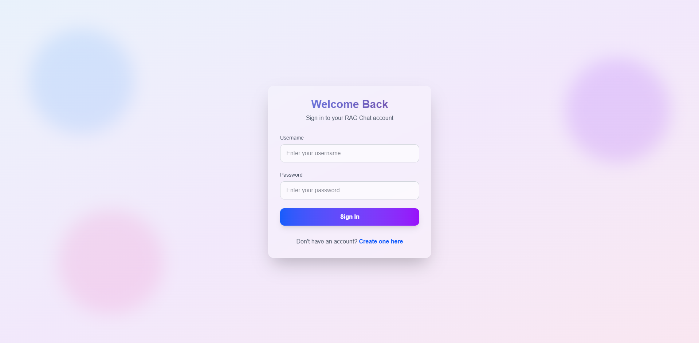
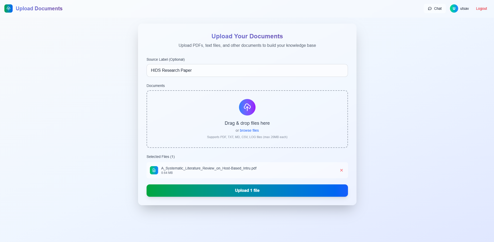
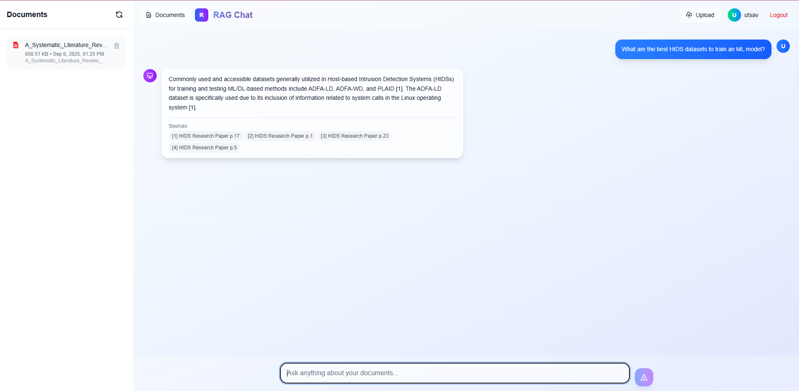

# 🤖 RAG Chatbot - Intelligent Document Q&A System

[](https://python.org)
[](https://djangoproject.com)
[](https://reactjs.org)
[](https://langchain.com)
[](https://chromadb.com)

A sophisticated **Retrieval-Augmented Generation (RAG)** chatbot that allows users to upload documents and ask intelligent questions about their content. Built with Django REST API backend and React frontend, powered by LangChain and ChromaDB for vector storage.

## 📋 Table of Contents

- [What is RAG?](#what-is-rag)
- [Features](#features)
- [Architecture](#architecture)
- [Tech Stack](#tech-stack)
- [Screenshots](#screenshots)
- [Installation & Setup](#installation--setup)
- [API Documentation](#api-documentation)
- [Usage Guide](#usage-guide)
- [Configuration](#configuration)
- [Project Structure](#project-structure)

## 🔍 What is RAG?

**Retrieval-Augmented Generation (RAG)** is an advanced AI technique that combines the power of information retrieval with text generation. Here's how it works:

### The RAG Process:

1. **📚 Document Ingestion**: Documents are uploaded and processed into smaller, searchable chunks
2. **🔢 Vectorization**: Text chunks are converted into high-dimensional vectors using embedding models
3. **🗄️ Storage**: Vectors are stored in a vector database (ChromaDB) for fast similarity search
4. **🔍 Retrieval**: When a user asks a question, the system finds the most relevant document chunks
5. **🤖 Generation**: A language model generates an answer using the retrieved context
6. **📝 Response**: The user receives an accurate, source-backed answer

### Why RAG Matters:

- **🎯 Accuracy**: Answers are grounded in actual documents, reducing hallucinations
- **📖 Source Attribution**: Users can see which documents informed the answer
- **🔄 Real-time Knowledge**: No need to retrain models when documents change
- **💡 Context-Aware**: Understands the specific content of your documents
- **🚀 Scalable**: Can handle large document collections efficiently

### Use Cases:

- **📊 Corporate Knowledge Base**: Answer questions about company policies, procedures, and documentation
- **🎓 Educational Content**: Help students find information in textbooks and research papers
- **⚖️ Legal Document Analysis**: Quickly find relevant information in contracts and legal documents
- **🔬 Research Assistance**: Analyze scientific papers and research findings
- **📈 Business Intelligence**: Query reports, analytics, and business documents
- **🛠️ Technical Documentation**: Help developers find information in code documentation

## ✨ Features

### 🔐 User Authentication
- Secure user registration and login
- JWT-based authentication
- User-specific document isolation

### 📄 Document Management
- **Multi-format Support**: PDF, TXT, MD, CSV, LOG files
- **Drag & Drop Upload**: Intuitive file upload interface
- **Batch Processing**: Upload multiple documents simultaneously
- **Document Metadata**: Track file size, upload date, and source labels
- **Document Deletion**: Remove documents from your knowledge base

### 🧠 Intelligent Q&A
- **Context-Aware Responses**: Answers based on your specific documents
- **Source Citations**: See which documents informed each answer
- **Similarity Scoring**: Understand how relevant each source is
- **Configurable Retrieval**: Adjust the number of relevant chunks retrieved

### 🎨 Modern UI/UX
- **Responsive Design**: Works on desktop, tablet, and mobile
- **Real-time Chat Interface**: Smooth conversation experience
- **Document Sidebar**: Easy access to your uploaded documents
- **Loading States**: Clear feedback during processing
- **Error Handling**: User-friendly error messages

### ⚙️ Advanced Configuration
- **Multiple LLM Providers**: Support for Google Gemini, OpenAI, and Hugging Face models
- **Embedding Models**: Configurable text embedding models
- **Vector Database**: Persistent storage with ChromaDB
- **CORS Support**: Ready for production deployment

## 🏗️ Architecture

```
┌─────────────────┐    ┌──────────────────┐    ┌─────────────────┐
│  React Frontend │    │  Django Backend  │    │   Vector Store  │
│                 │    │                  │    │   (ChromaDB)    │
│  • Chat UI      │◄──►│  • REST API      │◄──►│  • Embeddings   │
│  • Upload UI    │    │  • Authentication│    │  • Similarity   │
│  • Auth Context │    │  • Document Mgmt │    │    Search       │
│  • Routing      │    │  • RAG Pipeline  │    │                 │
└─────────────────┘    └──────────────────┘    └─────────────────┘
         │                       │                       │
         │                       │                       │
         ▼                       ▼                       ▼
┌─────────────────┐    ┌─────────────────┐    ┌─────────────────┐
│   User Browser  │    │   SQLite DB     │    │  File Storage   │
│                 │    │                 │    │                 │
│  • Session Mgmt │    │  • User Data    │    │  • Uploaded     │
│  • JWT Tokens   │    │  • Document     │    │    Documents    │
│                 │    │    Metadata     │    │                 │
└─────────────────┘    └─────────────────┘    └─────────────────┘
```

### Data Flow:

1. **Document Upload**: User uploads files → Django processes → ChromaDB stores vectors
2. **Query Processing**: User asks question → Vector similarity search → Context retrieval → LLM generation → Response
3. **Authentication**: JWT tokens manage user sessions and document access

## 🛠️ Tech Stack

### Backend
- **Django 5.2.6**: Web framework and API
- **Django REST Framework**: API development
- **LangChain 0.3.27**: RAG pipeline orchestration
- **ChromaDB 1.0.20**: Vector database for embeddings
- **Sentence Transformers**: Text embedding models
- **Google Gemini API**: Language model for generation
- **SQLite**: User and document metadata storage

### Frontend
- **React 19.1.1**: User interface framework
- **Vite**: Build tool and development server
- **Tailwind CSS**: Utility-first CSS framework
- **Axios**: HTTP client for API communication
- **React Router**: Client-side routing

### AI/ML Components
- **Embedding Model**: `sentence-transformers/all-MiniLM-L6-v2`
- **Language Model**: Google Gemini 2.5 Flash
- **Text Splitting**: Recursive character text splitter
- **Document Loaders**: PDF, text, and other format support

## 🖼️ Screenshots

**Login Page:**



**Document Upload:**



**Chat Interface With Document Management:**



## 🚀 Installation & Setup

### Prerequisites

- **Python 3.12+**
- **Node.js 18+**
- **npm** or **yarn**
- **Git**

### 1. Clone the Repository

```bash
git clone https://github.com/utsav1072/RAG/
cd RAG
```

### 2. Backend Setup

#### Create Virtual Environment
```bash
# Windows
python -m venv venv
venv\Scripts\activate

# macOS/Linux
python3 -m venv venv
source venv/bin/activate
```

#### Install Dependencies
```bash
pip install -r requirements.txt
```

#### Environment Configuration
Create a `.env` file in the `rag_chatbot` directory:

```env
# Django Configuration
DJANGO_SECRETE_KEY=your-secret-key-here
DEBUG=True

# Gemini API Configuration
GEMINI_API_KEY=your-gemini-api-key-here

# Optional: Customize RAG Settings
RAG_EMBEDDINGS_PROVIDER=huggingface
RAG_HF_MODEL_NAME=sentence-transformers/all-MiniLM-L6-v2
RAG_LLM_PROVIDER=huggingface
RAG_LLM_MODEL=gemini-2.5-flash
RAG_LLM_MAX_TOKENS=512
RAG_FETCH_K=20
RAG_SCORE_THRESHOLD=0.2
```

#### Database Setup
```bash
cd rag_chatbot
python manage.py makemigrations
python manage.py migrate
python manage.py createsuperuser
```

#### Start Backend Server
```bash
python manage.py runserver
```

The backend will be available at `http://localhost:8000`

### 3. Frontend Setup

#### Navigate to Frontend Directory
```bash
cd frontend/chat_ui
```

#### Install Dependencies
```bash
npm install
```

#### Start Development Server
```bash
npm run dev
```

The frontend will be available at `http://localhost:5173`

### 4. Access the Application

1. Open your browser and go to `http://localhost:5173`
2. Register a new account or login
3. Upload documents to build your knowledge base
4. Start asking questions!

## 📚 API Documentation

### Authentication Endpoints

#### Register User
```http
POST /api/auth/register/
Content-Type: application/json

{
    "username": "your_username",
    "email": "your_email@example.com",
    "password": "your_password"
}
```

#### Login
```http
POST /api/auth/token/
Content-Type: application/json

{
    "username": "your_username",
    "password": "your_password"
}
```

#### Get User Info
```http
GET /api/auth/me/
Authorization: Bearer <your_jwt_token>
```

### Document Management

#### Upload Documents
```http
POST /api/documents/upload/
Authorization: Bearer <your_jwt_token>
Content-Type: multipart/form-data

files: [file1, file2, ...]
source: "optional_source_label"
```

#### Get User Documents
```http
GET /api/documents/
Authorization: Bearer <your_jwt_token>
```

#### Delete Document
```http
DELETE /api/documents/{document_id}/delete/
Authorization: Bearer <your_jwt_token>
```

### RAG Query

#### Ask Question
```http
POST /api/query/
Authorization: Bearer <your_jwt_token>
Content-Type: application/json

{
    "query": "What is the main topic of the document?",
    "top_k": 4,
    "generate": true,
    "temperature": 0.7
}
```

#### Response Format
```json
{
    "results": [
        {
            "content": "Document chunk content...",
            "metadata": {
                "source": "document.pdf",
                "page": 1
            },
            "score": 0.85
        }
    ],
    "answer": "Generated answer based on retrieved context...",
    "citations": ["[1]", "[2]"]
}
```

## 📖 Usage Guide

### Getting Started

1. **Create Account**: Register with a username, email, and password
2. **Upload Documents**: Use the upload page to add PDFs, text files, or other supported formats
3. **Start Chatting**: Navigate to the chat page and ask questions about your documents

### Best Practices

#### Document Upload
- **File Size**: Keep individual files under 20MB for optimal performance
- **File Types**: PDFs work best, but TXT, MD, CSV, and LOG files are also supported
- **Source Labels**: Add descriptive labels to organize your documents
- **Batch Upload**: Upload related documents together for better context

#### Asking Questions
- **Be Specific**: Ask detailed questions for better answers
- **Use Keywords**: Include relevant terms from your documents
- **Follow-up Questions**: Build on previous answers for deeper insights
- **Check Citations**: Review source documents for additional context

#### Document Management
- **Regular Cleanup**: Remove outdated or irrelevant documents
- **Organize by Topic**: Use source labels to group related documents
- **Monitor Usage**: Check which documents are most frequently referenced

### Example Queries

```
"What are the main findings in the research paper?"
"Summarize the key points from the company handbook"
"What procedures should I follow for customer complaints?"
"Find information about the new product launch strategy"
"What are the safety guidelines mentioned in the manual?"
```

## ⚙️ Configuration

### Environment Variables

| Variable | Description | Default |
|----------|-------------|---------|
| `DJANGO_SECRETE_KEY` | Django secret key | Required |
| `GEMINI_API_KEY` | Google Gemini API key | Required |
| `RAG_EMBEDDINGS_PROVIDER` | Embedding provider | `huggingface` |
| `RAG_HF_MODEL_NAME` | Hugging Face model | `sentence-transformers/all-MiniLM-L6-v2` |
| `RAG_LLM_PROVIDER` | LLM provider | `huggingface` |
| `RAG_LLM_MODEL` | Language model | `gemini-2.5-flash` |
| `RAG_LLM_MAX_TOKENS` | Max tokens for generation | `512` |
| `RAG_FETCH_K` | Documents to retrieve | `20` |
| `RAG_SCORE_THRESHOLD` | Similarity threshold | `0.2` |

### Customization Options

#### Embedding Models
You can use different embedding models by changing the `RAG_HF_MODEL_NAME`:

```env
# For better performance (larger model)
RAG_HF_MODEL_NAME=sentence-transformers/all-mpnet-base-v2

# For faster processing (smaller model)
RAG_HF_MODEL_NAME=sentence-transformers/all-MiniLM-L12-v2
```

#### Language Models
Switch between different LLM providers:

```env
# Google Gemini (recommended)
RAG_LLM_PROVIDER=huggingface
RAG_LLM_MODEL=gemini-2.5-flash

# OpenAI (requires OpenAI API key)
RAG_LLM_PROVIDER=openai
RAG_OPENAI_MODEL=gpt-4o-mini
```

## 📁 Project Structure

```
RAG/
├── frontend/
│   └── chat_ui/                 # React frontend application
│       ├── src/
│       │   ├── auth/           # Authentication components
│       │   ├── components/     # Reusable UI components
│       │   ├── pages/          # Main application pages
│       │   └── assets/         # Static assets
│       ├── package.json        # Frontend dependencies
│       └── vite.config.js      # Vite configuration
├── rag_chatbot/                # Django backend application
│   ├── chatbot/                # Main Django app
│   │   ├── models.py          # Database models
│   │   ├── views.py           # API views
│   │   ├── serializers.py     # Data serializers
│   │   └── urls.py            # URL routing
│   ├── rag_chatbot/           # Django project settings
│   │   ├── settings.py        # Configuration
│   │   └── urls.py            # Main URL configuration
│   ├── chroma/                # ChromaDB vector storage
│   ├── media/                 # Uploaded files
│   └── manage.py              # Django management script
├── requirements.txt            # Python dependencies
└── README.md                  # This file
```

### Key Files Explained

- **`models.py`**: Defines the Document model for tracking uploaded files
- **`views.py`**: Contains API endpoints for authentication, document upload, and RAG queries
- **`serializers.py`**: Handles data validation and serialization
- **`settings.py`**: Django configuration including RAG and database settings
- **`ChatPage.jsx`**: Main chat interface component
- **`UploadPage.jsx`**: Document upload interface
- **`AuthContext.jsx`**: Authentication state management


## 🙏 Acknowledgments

- **LangChain**: For the excellent RAG framework
- **ChromaDB**: For vector storage capabilities
- **Google**: For the Gemini language model
- **Django**: For the robust web framework
- **React**: For the modern frontend framework
- **Tailwind CSS**: For the beautiful styling system

*This project demonstrates modern RAG implementation with a focus on user experience, scalability, and maintainability.*
